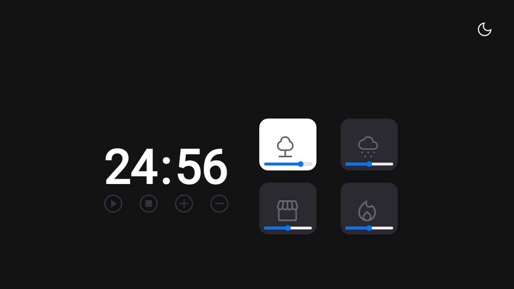

# Desafio FocusTimer - Versão 2.0 Dark Mode

Desafio do Stage05 que faz parte do Programa Explorer da Rocketseat  

Dentro desse desafio teremos dois desafios pra você. Preparado? 👀
****Você irá:  

- Criar a versão Dark Mode;
- Trabalhar com o volume dos sons de cada card.

1. Funcionalidade do botão no canto superior direito: 
É ali que você vai alternar entre o Dark Mode e o Light Mode. 
Importante ressaltar: o ícone se altera de acordo com o Mode que ele se encontra, viu? 😉 

2. As funcionalidades dos botões, continuam as mesmas: 
    - Play   : aciona o timer;
    - Stop   : para o timer;
    - +    : aumenta em mais 5 minutos o tempo do timer;
    - -    : diminui em 5 minutos o tempo do timer.
3. Funcionalidade de um card:  
Como no desafio anterior, quando um card é selecionado ele muda de cor e começa a tocar o som específico, certo?  
Nessa versão, além disso, o volume deverá ser controlado pelo slider que está embaixo de cada ícone. 

Obs: por padrão, quando você clicar em qualquer área de um card, você pode deixar o volume em 50%. 

## Screenshots

[🔗 Clique aqui para acessar o Projeto](https://fabiovascao.github.io/JavaScript-Intermediario-Desafio-02/)  
[🔗 Clique aqui para acessar o Figma](https://www.figma.com/file/nlJJAVuGDc1tnDKqUW4FJA/Stage-05---Dark-Mode-FocusTimer/duplicate)  

## 🛠 Tecnologias

- HTML
- CSS
- Git e Github
- JavaScript

## Autor

- [@FabioVascão](https://www.github.com/fabiovascao)